# Azure Local 23H2 Deployment
<!-- TOC -->

- [Azure Local 23H2 Deployment](#azure-local-23h2-deployment)
    - [About the lab](#about-the-lab)
        - [Prerequisites](#prerequisites)
        - [LabConfig](#labconfig)
        - [NTP Prerequisite Virtual Lab](#ntp-prerequisite-virtual-lab)
    - [The Lab](#the-lab)
        - [Task01 - Validate connectivity to servers](#task01---validate-connectivity-to-servers)
            - [Step 1 Test name resolution works with simple ping](#step-1-test-name-resolution-works-with-simple-ping)
            - [Step 2 Check WinRM connectivity](#step-2-check-winrm-connectivity)
            - [Step 3 Connect to servers using WinRM](#step-3-connect-to-servers-using-winrm)
        - [Task02 - Install updates and features](#task02---install-updates-and-features)
            - [Step 1 Install server features, and updates](#step-1-install-server-features-and-updates)
            - [Step 2 Install Dell Drivers - AX Nodes](#step-2-install-dell-drivers---ax-nodes)
            - [Step 3 Restart servers to apply changes](#step-3-restart-servers-to-apply-changes)
        - [Task03 - Validate environment using Environment Checker tool](#task03---validate-environment-using-environment-checker-tool)
        - [Task04 - Create Azure Resources](#task04---create-azure-resources)
        - [Task05 - Create AD Prerequisites](#task05---create-ad-prerequisites)
        - [Task 06a - Connect nodes to Azure - WebUI](#task-06a---connect-nodes-to-azure---webui)
        - [Task 06b - Connect nodes to Azure - PowerShell](#task-06b---connect-nodes-to-azure---powershell)
        - [Task07 - Validation Prerequisites](#task07---validation-prerequisites)
        - [Task08 - Validation Prerequisites - AXNodes](#task08---validation-prerequisites---axnodes)
            - [Step 1 - Populate latest SBE package AXNodes only](#step-1---populate-latest-sbe-package-axnodes-only)
            - [Step 2 - Exclude iDRAC adapters from cluster networks](#step-2---exclude-idrac-adapters-from-cluster-networks)
            - [Step 3 - Clear data disks](#step-3---clear-data-disks)
            - [Step 4 - Reboot iDRAC if needed](#step-4---reboot-idrac-if-needed)
            - [Step 5 - Install just Network Drivers - Mellanox](#step-5---install-just-network-drivers---mellanox)
        - [Task 09 - Deploy Azure Local from Azure Portal](#task-09---deploy-azure-local-from-azure-portal)

<!-- /TOC -->

## About the lab

In this lab you will deploy 2 node Azure Local cluster using [cloud deployment](https://learn.microsoft.com/en-us/azure-stack/hci/whats-new#cloud-based-deployment).

You can also deploy physical machines with [MDT](../../admin-guides/03-DeployPhysicalServersWithMSLab/readme.md). In this guide you will also see notes for physical environment.

You can deploy physical machines with simple click-next-next from ISO. Make sure correct OS disk is selected and if DHCP is not available, configure an IP address and rename computers.

[Latest ISO](https://aka.ms/HCIReleaseImage) contains web interface to register servers to Azure. It also contains all Az PowerShell modules, so it's not necessary to upload it into nodes.
[Older ISO](https://software-static.download.prss.microsoft.com/dbazure/888969d5-f34g-4e03-ac9d-1f9786c66749/25398.469.231004-1141.zn_release_svc_refresh_SERVERAZURESTACKHCICOR_OEMRET_x64FRE_en-us.iso) does not contain webUI and PowerShell modules.

You can register servers using PowerShell or using WebUI. WebUI process simplifies the deployment a bit, but several steps are still needed. The OS will automatically use SN of the server and will use it as a hostname. If you are on the same network, you can simply navigate to https://`<device-serial-number>`.local (it uses local discovery).

### Prerequisites

* Hydrated MSLab with LabConfig from [01-HydrateMSLab](../../admin-guides/01-HydrateMSLab/readme.md)

* Understand [how MSLab works](../../admin-guides/02-WorkingWithMSLab/readme.md)

* Make sure you hydrate latest [Azure Local 23H2 Image](https://aka.ms/HCIReleaseImage) using CreateParentDisk.ps1 located in ParentDisks folder as it contains [WebUI onboarding](https://learn.microsoft.com/en-us/azure-stack/hci/deploy/deployment-arc-register-local-ui)

* Note: this lab uses ~60GB RAM. To reduce amount of RAM, you would need to reduce number of nodes.

### LabConfig

```PowerShell
$LabConfig=@{AllowedVLANs="1-10,711-719" ; DomainAdminName='LabAdmin'; AdminPassword='LS1setup!' ; DCEdition='4'; Internet=$true; TelemetryLevel='Full' ; TelemetryNickname='' ; AdditionalNetworksConfig=@(); VMs=@()}

#Azure Local 23H2
#labconfig will not domain join VMs
1..2 | ForEach-Object {$LABConfig.VMs += @{ VMName = "ALNode$_" ; Configuration = 'S2D' ; ParentVHD = 'AzSHCI23H2_G2.vhdx' ; HDDNumber = 4 ; HDDSize= 1TB ; MemoryStartupBytes= 24GB; VMProcessorCount="MAX" ; vTPM=$true ; Unattend="NoDjoin" ; NestedVirt=$true }}

#Windows Admin Center in GW mode
$LabConfig.VMs += @{ VMName = 'WACGW' ; ParentVHD = 'Win2025Core_G2.vhdx'; MGMTNICs=1}

#Management machine (windows server 2025)
$LabConfig.VMs += @{ VMName = 'Management' ; ParentVHD = 'Win2025_G2.vhdx'; MGMTNICs=1 ; AddToolsVHD=$True }
 
```

result: 

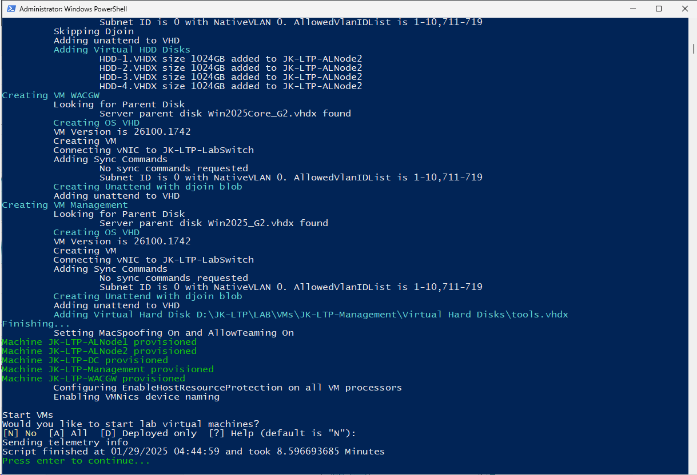

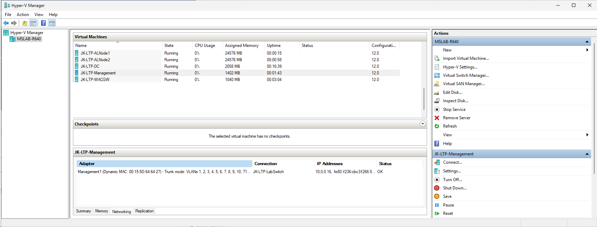


### NTP Prerequisite (Virtual Lab)

To successfully configure NTP server it's necessary to disable time synchronization from Hyper-V host.

Run following code **from hyper-v host** to disable time sync

```PowerShell
Get-VM *ALNode* | Disable-VMIntegrationService -Name "Time Synchronization"

```

## The Lab

**Run all commands from Management machine**

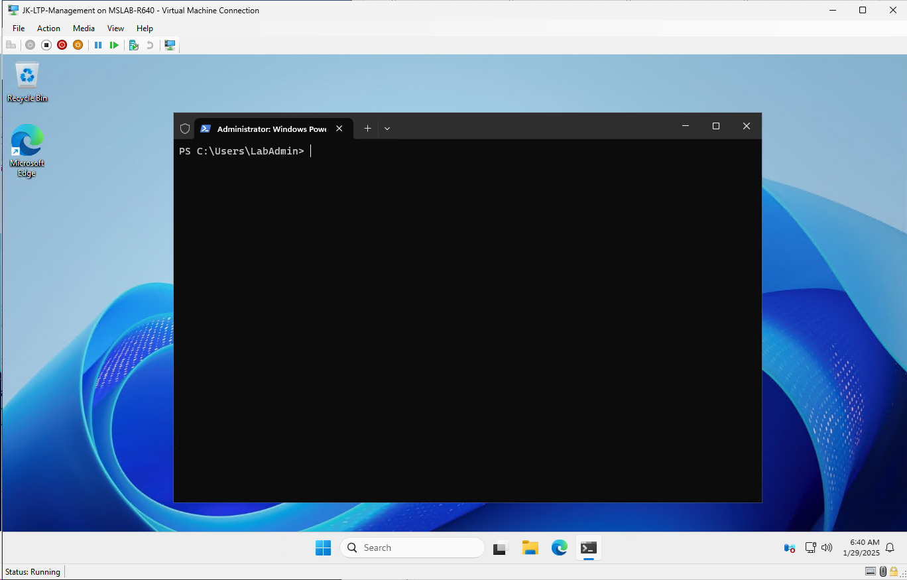

### Task01 - Validate connectivity to servers

#### Step 1 Test name resolution works with simple ping

> If name resolution does not work, simply add IPs to hosts file  you can even use [Host File Editor](https://learn.microsoft.com/en-us/windows/powertoys/hosts-file-editor)

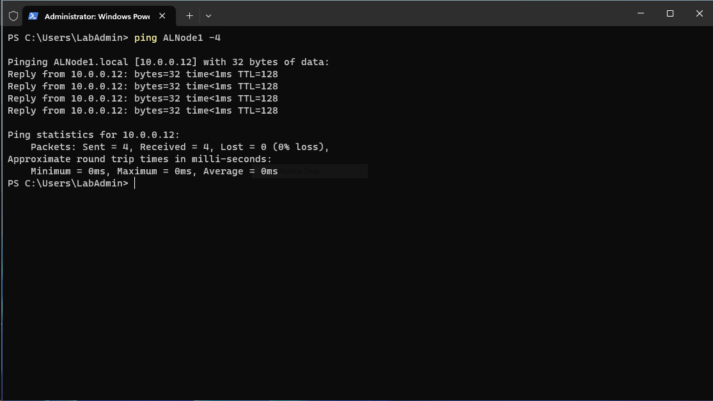

Notice, that host is replying. Latest image Azure Local already allows ICMP packets. Important is, that name resolution works

#### Step 2 Check WinRM connectivity

```PowerShell
Test-NetConnection -ComputerName "ALNode1","ALNode2" -CommonTCPPort WINRM

```

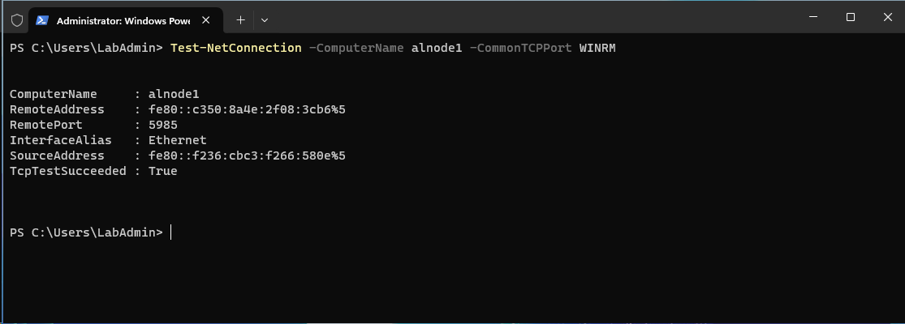

> If WINRM fails and if your management is in different subnet, Windows Firewall is by default configured to accept connections on local subnet only

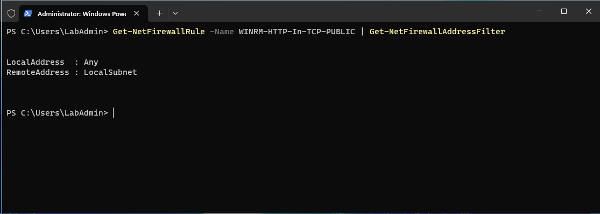

> you can modify it by running following code on every node (any, or just some IP address/range)

```Powershell
Get-NetFirewallRule -Name WINRM-HTTP-In-TCP-PUBLIC | Get-NetFirewallAddressFilter | Set-NetFirewallAddressFilter -RemoteAddress Any
 
```

#### Step 3 Connect to servers using WinRM

```PowerShell
$Servers="ALNode1","ALNode2"
$UserName="Administrator"
$Password="LS1setup!"
$SecuredPassword = ConvertTo-SecureString $password -AsPlainText -Force
$Credentials= New-Object System.Management.Automation.PSCredential ($UserName,$SecuredPassword)

#configure trusted hosts to be able to communicate with servers
$TrustedHosts=@()
$TrustedHosts+=$Servers
Set-Item WSMan:\localhost\Client\TrustedHosts -Value $($TrustedHosts -join ',') -Force

#Send some command to servers
Invoke-Command -ComputerName $Servers -ScriptBlock {
    Get-NetAdapter
} -Credential $Credentials

```

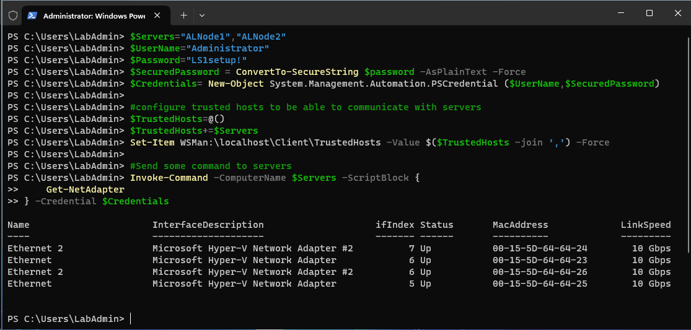

### Task02 - Install updates and features

If you receive servers from factory, drivers are already installed. And since updating OS is optional, you can skip the entire task.

#### Step 1 Install server features, and updates

I prefer to install OS updates in this step as OS version (UBR) is 469, while January2025 version is 1308. OS updates are installed as part of deployment, so this step is optional.

Features are also optional as features are already present in latest ISO.

```PowerShell
#install hyper-v and Failover-Clustering feature (this is useful if you use older ISO)
#failover clustering will enable firewall rules such as icmp, computer management, event log management... 

Invoke-Command -ComputerName $servers -ScriptBlock {
    Enable-WindowsOptionalFeature -FeatureName Microsoft-Hyper-V -Online -NoRestart
    Install-WindowsFeature -Name Failover-Clustering
} -Credential $Credentials


#Check servers version
$ComputersInfo  = Invoke-Command -ComputerName $servers -ScriptBlock {
    Get-ItemProperty -Path $using:RegistryPath
} -Credential $Credentials
$ComputersInfo | Select-Object PSComputerName,ProductName,DisplayVersion,UBR

#region update all servers
    Invoke-Command -ComputerName $servers -ScriptBlock {
        New-PSSessionConfigurationFile -RunAsVirtualAccount -Path $env:TEMP\VirtualAccount.pssc
        Register-PSSessionConfiguration -Name 'VirtualAccount' -Path $env:TEMP\VirtualAccount.pssc -Force
    } -ErrorAction Ignore -Credential $Credentials
    #sleep a bit
    Start-Sleep 2
    # Run Windows Update via ComObject.
    Invoke-Command -ComputerName $servers -ConfigurationName 'VirtualAccount' -ScriptBlock {
        $Searcher = New-Object -ComObject Microsoft.Update.Searcher
        $SearchCriteriaAllUpdates = "IsInstalled=0 and DeploymentAction='Installation' or
                                IsInstalled=0 and DeploymentAction='OptionalInstallation' or
                                IsPresent=1 and DeploymentAction='Uninstallation' or
                                IsInstalled=1 and DeploymentAction='Installation' and RebootRequired=1 or
                                IsInstalled=0 and DeploymentAction='Uninstallation' and RebootRequired=1"
        $SearchResult = $Searcher.Search($SearchCriteriaAllUpdates).Updates
        if ($SearchResult.Count -gt 0){
            $Session = New-Object -ComObject Microsoft.Update.Session
            $Downloader = $Session.CreateUpdateDownloader()
            $Downloader.Updates = $SearchResult
            $Downloader.Download()
            $Installer = New-Object -ComObject Microsoft.Update.Installer
            $Installer.Updates = $SearchResult
            $Result = $Installer.Install()
            $Result
        }
    } -Credential $Credentials
    #remove temporary PSsession config
    Invoke-Command -ComputerName $servers -ScriptBlock {
        Unregister-PSSessionConfiguration -Name 'VirtualAccount'
        Remove-Item -Path $env:TEMP\VirtualAccount.pssc
    }  -Credential $Credentials
#endregion

```

#### Step 2 Install Dell Drivers - AX Nodes

The validation process later in the guide makes sure if you don't have default NIC driver. So you can either install all drivers, or just Mellanox/Intel NIC driver.

Following example installs all drivers and in case you have newer drivers, it will downgrade. You can simply modify the code to just scan for compliance and display status. This will also make your life easier if for some reason you updated to newer drivers than SBE. SBE would fail as firmware extension can't downgrade.

```PowerShell
#region Dell AX Nodes
    #region update servers with latest hardware updates
        $DSUDownloadFolder="$env:USERPROFILE\Downloads\DSU"

        #Set up web client to download files with authenticated web request
        $WebClient = New-Object System.Net.WebClient
        #$proxy = new-object System.Net.WebProxy
        $proxy = [System.Net.WebRequest]::GetSystemWebProxy()
        $proxy.Credentials = [System.Net.CredentialCache]::DefaultCredentials
        #$proxy.Address = $proxyAdr
        #$proxy.useDefaultCredentials = $true
        $WebClient.proxy = $proxy

        #Download DSU
        #https://github.com/DellProSupportGse/Tools/blob/main/DART.ps1
        #download latest DSU to Downloads
            $LatestDSU="https://dl.dell.com/FOLDER10889507M/1/Systems-Management_Application_RPW7K_WN64_2.0.2.3_A00.EXE"
            if (-not (Test-Path $DSUDownloadFolder -ErrorAction Ignore)){New-Item -Path $DSUDownloadFolder -ItemType Directory}
            #Start-BitsTransfer -Source $LatestDSU -Destination $DSUDownloadFolder\DSU.exe
            $WebClient.DownloadFile($LatestDSU,"$DSUDownloadFolder\DSU.exe")

        #Download catalog and unpack
            #Start-BitsTransfer -Source "https://downloads.dell.com/catalog/ASHCI-Catalog.xml.gz" -Destination "$DSUDownloadFolder\ASHCI-Catalog.xml.gz"
            $WebClient.DownloadFile("https://downloads.dell.com/catalog/ASHCI-Catalog.xml.gz","$DSUDownloadFolder\ASHCI-Catalog.xml.gz")     

            #unzip gzip to a folder https://scatteredcode.net/download-and-extract-gzip-tar-with-powershell/
            Function Expand-GZipArchive{
                Param(
                    $infile,
                    $outfile = ($infile -replace '\.gz$','')
                    )
                $input = New-Object System.IO.FileStream $inFile, ([IO.FileMode]::Open), ([IO.FileAccess]::Read), ([IO.FileShare]::Read)
                $output = New-Object System.IO.FileStream $outFile, ([IO.FileMode]::Create), ([IO.FileAccess]::Write), ([IO.FileShare]::None)
                $gzipStream = New-Object System.IO.Compression.GzipStream $input, ([IO.Compression.CompressionMode]::Decompress)
                $buffer = New-Object byte[](1024)
                while($true){
                    $read = $gzipstream.Read($buffer, 0, 1024)
                    if ($read -le 0){break}
                    $output.Write($buffer, 0, $read)
                    }
                $gzipStream.Close()
                $output.Close()
                $input.Close()
            }
            Expand-GZipArchive "$DSUDownloadFolder\ASHCI-Catalog.xml.gz" "$DSUDownloadFolder\ASHCI-Catalog.xml"

        #upload DSU and catalog to servers
        $Sessions=New-PSSession -ComputerName $Servers -Credential $Credentials
        Invoke-Command -Session $Sessions -ScriptBlock {
            if (-not (Test-Path $using:DSUDownloadFolder -ErrorAction Ignore)){New-Item -Path $using:DSUDownloadFolder -ItemType Directory}
        }
        foreach ($Session in $Sessions){
            Copy-Item -Path "$DSUDownloadFolder\DSU.exe" -Destination "$DSUDownloadFolder" -ToSession $Session -Force -Recurse
            Copy-Item -Path "$DSUDownloadFolder\ASHCI-Catalog.xml" -Destination "$DSUDownloadFolder" -ToSession $Session -Force -Recurse
        }

        #install DSU
        Invoke-Command -Session $Sessions -ScriptBlock {
            Start-Process -FilePath "$using:DSUDownloadFolder\DSU.exe" -ArgumentList "/silent" -Wait 
        }

        #Check compliance
        Invoke-Command -Session $Sessions -ScriptBlock {
            & "C:\Program Files\Dell\DELL System Update\DSU.exe" --compliance --output-format="json" --output="$using:DSUDownloadFolder\Compliance.json" --catalog-location="$using:DSUDownloadFolder\ASHCI-Catalog.xml"
        }

        #collect results
        $Compliance=@()
        foreach ($Session in $Sessions){
            $json=Invoke-Command -Session $Session -ScriptBlock {Get-Content "$using:DSUDownloadFolder\Compliance.json"}
            $object = $json | ConvertFrom-Json 
            $components=$object.SystemUpdateCompliance.UpdateableComponent
            $components | Add-Member -MemberType NoteProperty -Name "ClusterName" -Value $ClusterName
            $components | Add-Member -MemberType NoteProperty -Name "ServerName" -Value $Session.ComputerName
            $Compliance+=$Components
        }

        #display results
        $Compliance | Out-GridView

        #Or just choose what updates to install
        #$Compliance=$Compliance | Out-GridView -OutputMode Multiple

        #or Select only NIC drivers/firmware (as the rest will be processed by SBE)
        #$Compliance=$Compliance | Where-Object categoryType -eq "NI"

        #Install Dell updates https://www.dell.com/support/home/en-us/product-support/product/system-update/docs
        Invoke-Command -Session $Sessions -ScriptBlock {
            $Packages=(($using:Compliance | Where-Object {$_.ServerName -eq $env:computername -and $_.compliancestatus -eq $false}))
            if ($Packages){
                $UpdateNames=($packages.PackageFilePath | Split-Path -Leaf) -join ","
                & "C:\Program Files\Dell\DELL System Update\DSU.exe" --catalog-location="$using:DSUDownloadFolder\ASHCI-Catalog.xml" --update-list="$UpdateNames" --apply-upgrades --apply-downgrades
            }
        }
        $Sessions | Remove-PSSession
#endregion
 
```

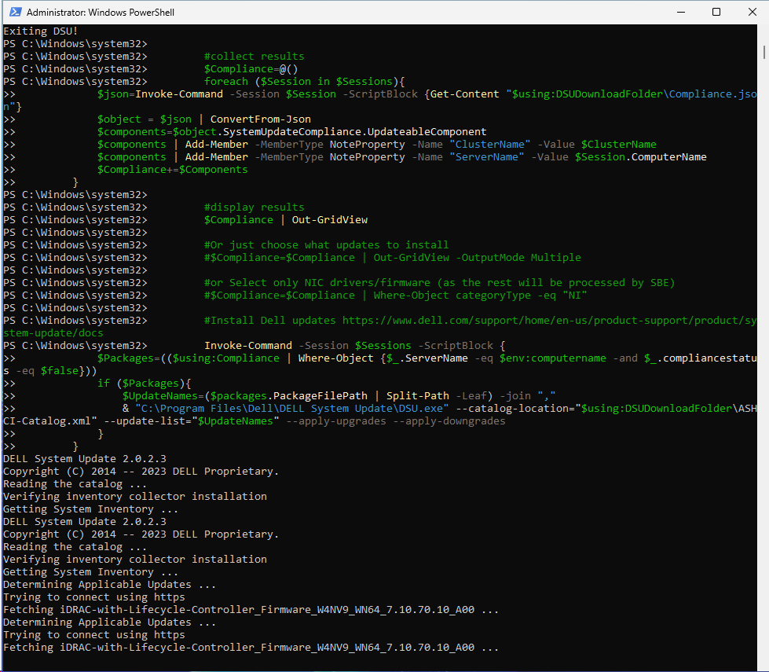

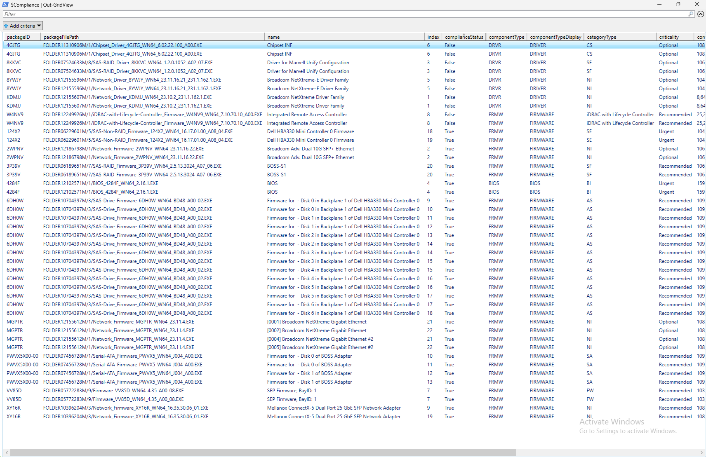

#### Step 3 Restart servers to apply changes

```PowerShell
#region restart servers to apply changes
    Restart-Computer -ComputerName $Servers -Credential $Credentials -WsmanAuthentication Negotiate -Wait -For PowerShell
    Start-Sleep 20 #Failsafe as Hyper-V needs 2 reboots and sometimes it happens, that during the first reboot the restart-computer evaluates the machine is up
    #make sure computers are restarted
    Foreach ($Server in $Servers){
        do{$Test= Test-NetConnection -ComputerName $Server -CommonTCPPort WINRM}while ($test.TcpTestSucceeded -eq $False)
    }
#endregion

#Check servers version again
$ComputersInfo  = Invoke-Command -ComputerName $servers -ScriptBlock {
    Get-ItemProperty -Path $using:RegistryPath
} -Credential $Credentials
$ComputersInfo | Select-Object PSComputerName,ProductName,DisplayVersion,UBR
 
```

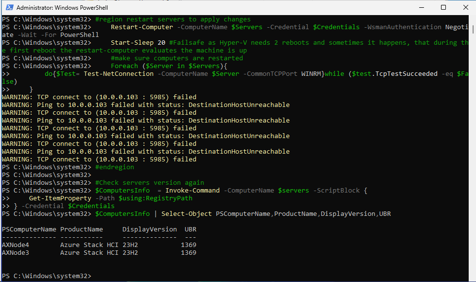

### Task03 - Validate environment using Environment Checker tool

* about: https://learn.microsoft.com/en-in/azure/azure-local/manage/use-environment-checker?tabs=connectivity

Since we already have credentials and TrustedHosts configured in Powershell from Task01, we can run the following code

> for some reason I was not able to run it using sessions as it complained about not being able to create PSDrive

```PowerShell
$result=Invoke-Command -ComputerName $Servers -Scriptblock {
    Install-PackageProvider -Name NuGet -MinimumVersion 2.8.5.201 -Force
    Install-Module PowerShellGet -AllowClobber -Force
    Install-Module -Name AzStackHci.EnvironmentChecker -Force
    Invoke-AzStackHciConnectivityValidation -PassThru
} -Credential $Credentials
$result | Out-GridView

```

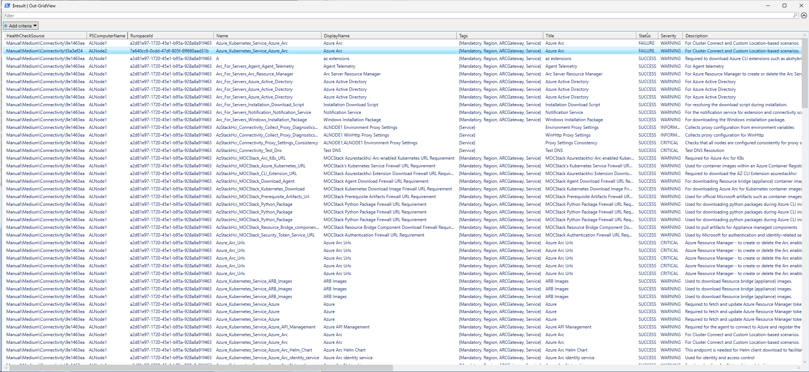

### Task04 - Create Azure Resources

Following script will simply create Resource Group and ARC Gateway (optional).

```PowerShell
$GatewayName="ALClus01-ArcGW"
$ResourceGroupName="ALClus01-RG"
$Location="eastus"

#login to azure
    #download Azure module
    Install-PackageProvider -Name NuGet -MinimumVersion 2.8.5.201 -Force
    if (!(Get-InstalledModule -Name az.accounts -ErrorAction Ignore)){
        Install-Module -Name Az.Accounts -Force 
    }
    #login using device authentication
    Connect-AzAccount -UseDeviceAuthentication

    #assuming new az.accounts module was used and it asked you what subscription to use - then correct subscription is selected for context
    $Subscription=(Get-AzContext).Subscription

    #install az resources module
        if (!(Get-InstalledModule -Name az.resources -ErrorAction Ignore)){
            Install-Module -Name az.resources -Force
        }

    #create resource group
        if (-not(Get-AzResourceGroup -Name $ResourceGroupName -ErrorAction Ignore)){
            New-AzResourceGroup -Name $ResourceGroupName -Location $location
        }
#region (Optional) configure ARC Gateway
<#
    #install az arcgateway module
        if (!(Get-InstalledModule -Name az.arcgateway -ErrorAction Ignore)){
            Install-Module -Name az.arcgateway -Force
        }
    #make sure "Microsoft.HybridCompute" is registered (and possibly other RPs)
        Register-AzResourceProvider -ProviderNamespace "Microsoft.HybridCompute"
        Register-AzResourceProvider -ProviderNamespace "Microsoft.GuestConfiguration"
        Register-AzResourceProvider -ProviderNamespace "Microsoft.HybridConnectivity"
        Register-AzResourceProvider -ProviderNamespace "Microsoft.AzureStackHCI"

    #create GW
    $ArcGWInfo=New-AzArcGateway -Name $GatewayName -ResourceGroupName $ResourceGroupName -Location $Location -SubscriptionID $Subscription.ID
#>
#endregion

#generate variables for use in this window
$SubscriptionID=$Subscription.ID
$Region=$Location
$TenantID=$Subscription.TenantID
$ArcGatewayID=$ArcGWInfo.ID

#output variables (so you can just copy it and have powershell code to create variables in another session or you can copy it to WebUI deployment)
Write-Host -ForegroundColor Cyan @"
    #Variables to copy
    `$SubscriptionID=`"$($Subscription.ID)`"
    `$ResourceGroupName=`"$ResourceGroupName`"
    `$Region=`"$Location`"
    `$TenantID=`"$($subscription.tenantID)`"
    `$ArcGatewayID=`"$(($ArcGWInfo).ID)`"
"@ 
```

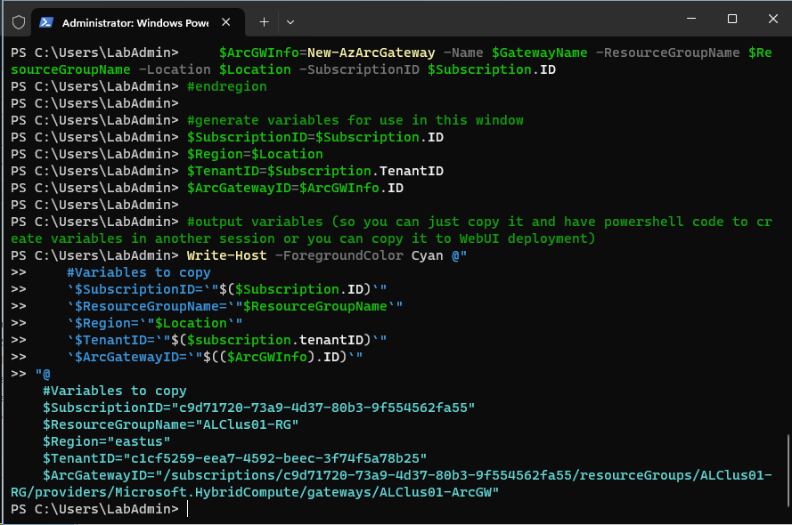

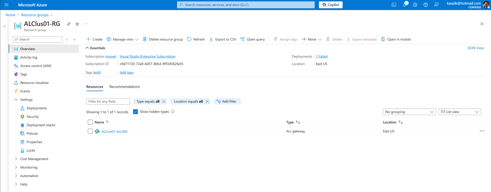


### Task05 - Create AD Prerequisites

Simply run the following PowerShell script to create objects

> LCM = LifeCycle Management account. Account that will be used to domain join machines and create CAU account.

```PowerShell
$AsHCIOUName="OU=ALClus01,DC=Corp,DC=contoso,DC=com"
$LCMUserName="ALClus01-LCMUser"
$LCMPassword="LS1setup!LS1setup!"
#Create LCM credentials
$SecuredPassword = ConvertTo-SecureString $LCMPassword -AsPlainText -Force
$LCMCredentials= New-Object System.Management.Automation.PSCredential ($LCMUserName,$SecuredPassword)

#create objects in Active Directory
    #install posh module for prestaging Active Directory
    Install-PackageProvider -Name NuGet -Force
    Install-Module AsHciADArtifactsPreCreationTool -Repository PSGallery -Force

    #make sure active directory module and GPMC is installed
    Install-WindowsFeature -Name RSAT-AD-PowerShell,GPMC

    #populate objects
    New-HciAdObjectsPreCreation -AzureStackLCMUserCredential $LCMCredentials -AsHciOUName $AsHCIOUName

    #to check OU (and future cluster) in GUI install management tools
    Install-WindowsFeature -Name "RSAT-ADDS","RSAT-Clustering"

```

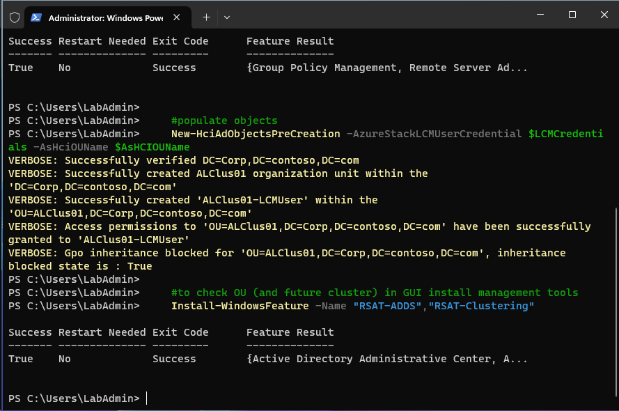

### Task 06a - Connect nodes to Azure - WebUI

As you now have all variables needed from Task03, you can proceed with navigating to WebUI on each node.

In MSLab you can simply navigate to https://LTPNode1 and https://LTPNode2. In production environment you can either navigate to https://<serialnumber> or simply configure an IP address and navigate there. The webUI takes ~15 minutes to start after booting the servers.

Log in with **Administrator/LS1setup!** and proceed with all three steps to register nodes to Azure.

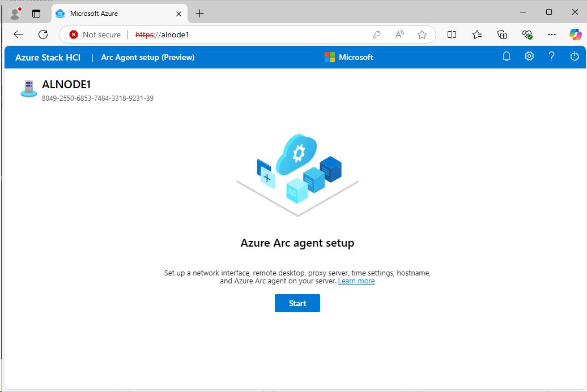

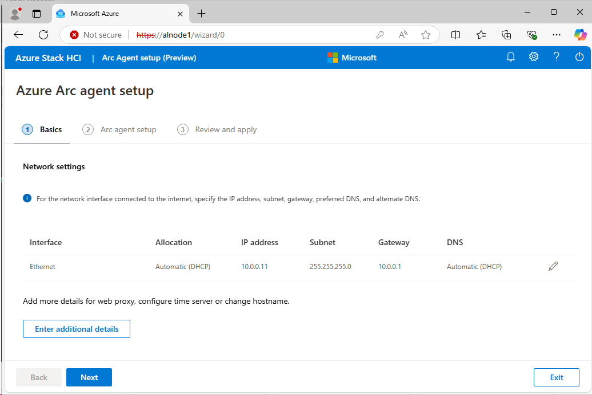


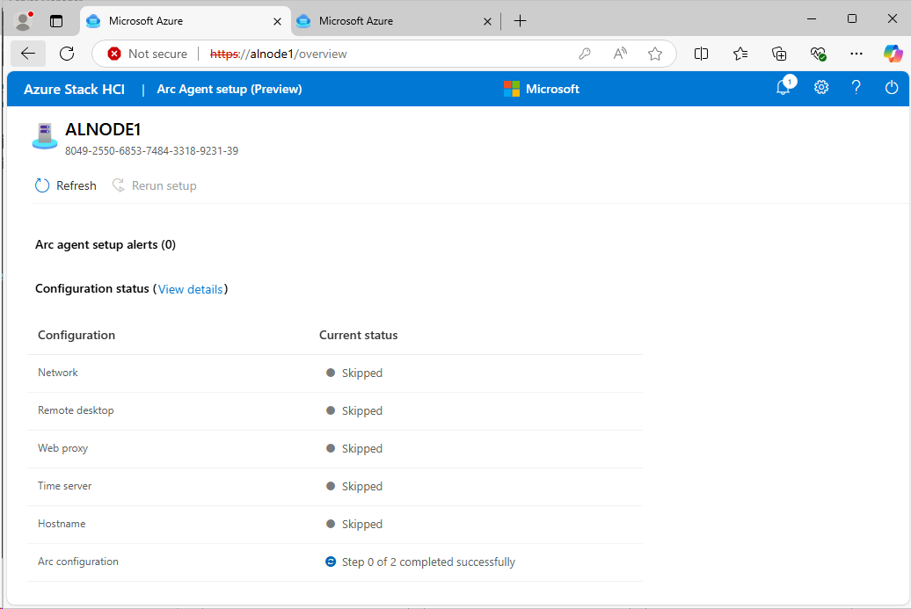


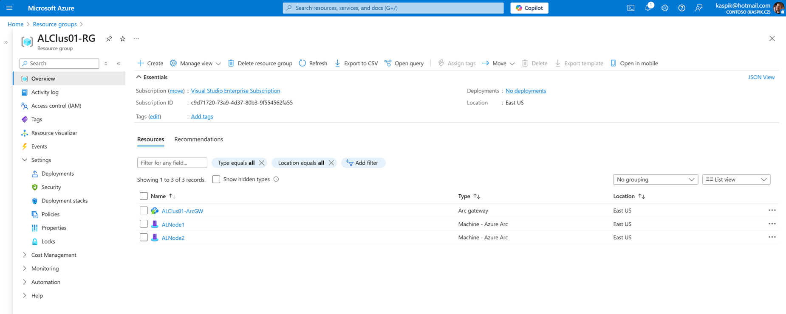

### Task 06b - Connect nodes to Azure - PowerShell

Assuming you have still variables from Task03, you can continue with following PowerShell

More info: https://learn.microsoft.com/en-us/azure/azure-local/deploy/deployment-arc-register-server-permissions?tabs=powershell

```PowerShell
#region install modules (latest ISO already contains modules, but does not hurt installing it)
    #make sure nuget is installed on nodes
    Invoke-Command -ComputerName $Servers -ScriptBlock {
        Install-PackageProvider -Name NuGet -MinimumVersion 2.8.5.201 -Force
    } -Credential $Credentials

    #make sure azshci.arcinstaller is installed on nodes
    Invoke-Command -ComputerName $Servers -ScriptBlock {
        Install-Module -Name azshci.arcinstaller -Force
    } -Credential $Credentials

    #make sure Az.Resources module is installed on nodes
    Invoke-Command -ComputerName $Servers -ScriptBlock {
        Install-Module -Name Az.Resources -Force
    } -Credential $Credentials

    #make sure az.accounts module is installed on nodes
    Invoke-Command -ComputerName $Servers -ScriptBlock {
        Install-Module -Name az.accounts -Force
    } -Credential $Credentials

    #make sure az.accounts module is installed on nodes
    Invoke-Command -ComputerName $Servers -ScriptBlock {
        Install-Module -Name Az.ConnectedMachine -Force
    } -Credential $Credentials
#endregion

#Make sure resource providers are registered
Register-AzResourceProvider -ProviderNamespace "Microsoft.HybridCompute"
Register-AzResourceProvider -ProviderNamespace "Microsoft.GuestConfiguration"
Register-AzResourceProvider -ProviderNamespace "Microsoft.HybridConnectivity"
Register-AzResourceProvider -ProviderNamespace "Microsoft.AzureStackHCI"

#deploy ARC Agent (with Arc Gateway, without proxy. For more examples visit https://learn.microsoft.com/en-us/azure/azure-local/deploy/deployment-arc-register-server-permissions?tabs=powershell)
    $ARMtoken = (Get-AzAccessToken).Token
    $id = (Get-AzContext).Account.Id
    $Cloud="AzureCloud"

    Invoke-Command -ComputerName $Servers -ScriptBlock {
        Invoke-AzStackHciArcInitialization -SubscriptionID $using:SubscriptionID -ResourceGroup $using:ResourceGroupName -TenantID $using:TenantID -Cloud $using:Cloud -Region $Using:Location -ArmAccessToken $using:ARMtoken -AccountID $using:id #-ArcGatewayID $using:ArcGatewayID
    } -Credential $Credentials
 
```


### Task07 - Validation Prerequisites

There are just few settings needed before successful validation for lab running in VMs

    * Making sure password is complex enough
    * Just one IP with Gateway (might change in future)
    * Static IP Address (might change in future)

Following PowerShell will make sure all is set

```PowerShell
#region and make sure password is complex and long enough (12chars at least)
    $NewPassword="LS1setup!LS1setup!"
    Invoke-Command -ComputerName $servers -ScriptBlock {
        Set-LocalUser -Name Administrator -AccountNeverExpires -Password (ConvertTo-SecureString $Using:NewPassword -AsPlainText -Force)
    } -Credential $Credentials
    #create new credentials
    $UserName="Administrator"
    $SecuredPassword = ConvertTo-SecureString $NewPassword -AsPlainText -Force
    $Credentials= New-Object System.Management.Automation.PSCredential ($UserName,$SecuredPassword)
#endregion

#region to successfully validate you need make sure there's just one GW
    #make sure there is only one management NIC with IP address (setup is complaining about multiple gateways)
    Invoke-Command -ComputerName $servers -ScriptBlock {
        Get-NetIPConfiguration | Where-Object IPV4defaultGateway | Get-NetAdapter | Sort-Object Name | Select-Object -Skip 1 | Set-NetIPInterface -Dhcp Disabled
    } -Credential $Credentials
#endregion

#region Convert DHCP address to Static (since 2411 there's a check for static IP)
    Invoke-Command -ComputerName $Servers -ScriptBlock {
        $InterfaceAlias=(Get-NetIPAddress -AddressFamily IPv4 | Where-Object {$_.IPAddress -NotLike "169*" -and $_.PrefixOrigin -eq "DHCP"}).InterfaceAlias
        $IPConf=Get-NetIPConfiguration -InterfaceAlias $InterfaceAlias
        $IPAddress=Get-NetIPAddress -AddressFamily IPv4 -InterfaceAlias $InterfaceAlias
        $IP=$IPAddress.IPAddress
        $Index=$IPAddress.InterfaceIndex
        $GW=$IPConf.IPv4DefaultGateway.NextHop
        $Prefix=$IPAddress.PrefixLength
        $DNSServers=@()
        $ipconf.dnsserver | ForEach-Object {if ($_.addressfamily -eq 2){$DNSServers+=$_.ServerAddresses}}
        Set-NetIPInterface -InterfaceIndex $Index -Dhcp Disabled
        New-NetIPAddress -InterfaceIndex $Index -AddressFamily IPv4 -IPAddress $IP -PrefixLength $Prefix -DefaultGateway $GW -ErrorAction SilentlyContinue
        Set-DnsClientServerAddress -InterfaceIndex $index -ServerAddresses $DNSServers
    } -Credential $Credentials
#endregion
 
```

### Task08 - Validation Prerequisites - AXNodes

One prerequisite is to install NIC Drivers, but we already covered this in Task02 where servers were updated

#### Step 1 - Populate latest SBE package (AXNodes only)

```PowerShell
    #region populate SBE package
        #Set up web client to download files with authenticated web request in case there's a proxy
        $WebClient = New-Object System.Net.WebClient
        #$proxy = new-object System.Net.WebProxy
        $proxy = [System.Net.WebRequest]::GetSystemWebProxy()
        $proxy.Credentials = [System.Net.CredentialCache]::DefaultCredentials
        #$proxy.Address = $proxyAdr
        #$proxy.useDefaultCredentials = $true
        $WebClient.proxy = $proxy
        #add headers wihth user-agent as some versions of SBE requires it for download
        $webclient.Headers.Add("User-Agent", "WhateverUser-AgentString/1.0")

        #Download SBE
            $LatestSBE="https://dl.dell.com/FOLDER12528657M/1/Bundle_SBE_Dell_AX-15G_4.1.2412.1201.zip"
            #or 16G
            #$LatestSBE="https://dl.dell.com/FOLDER12528644M/1/Bundle_SBE_Dell_AX-16G_4.1.2412.1202.zip"
            $FileName=$($LatestSBE.Split("/")| Select-Object -Last 1)
            $WebClient.DownloadFile($LatestSBE,"$env:userprofile\Downloads\$FileName")

            #Transfer to servers
            $Sessions=New-PSSession -ComputerName $Servers -Credential $Credentials
            foreach ($Session in $Sessions){
                Copy-Item -Path $env:userprofile\Downloads\$FileName -Destination c:\users\$UserName\Downloads\ -ToSession $Session
            }

        Invoke-Command -ComputerName $Servers -scriptblock {
            #unzip to c:\SBE
            New-Item -Path c:\ -Name SBE -ItemType Directory -ErrorAction Ignore
            Expand-Archive -LiteralPath $env:userprofile\Downloads\$using:FileName -DestinationPath C:\SBE -Force
        } -Credential $Credentials

        #populate latest metadata file
            #download
            Invoke-WebRequest -Uri https://aka.ms/AzureStackSBEUpdate/DellEMC -OutFile $env:userprofile\Downloads\SBE_Discovery_Dell.xml
            #copy to servers
            foreach ($Session in $Session){
                Copy-Item -Path $env:userprofile\Downloads\SBE_Discovery_Dell.xml -Destination C:\SBE -ToSession $Session
            }

        $Sessions | Remove-PSSession
    #endregion
```

#### Step 2 - Exclude iDRAC adapters from cluster networks

```PowerShell
#region exclude iDRAC adapters from cluster networks (as validation was failing in latest versions)
    Invoke-Command -computername $Servers -scriptblock {
        New-Item -Path HKLM:\system\currentcontrolset\services\clussvc\parameters
        New-ItemProperty -Path HKLM:\system\currentcontrolset\services\clussvc\parameters -Name ExcludeAdaptersByDescription -Value "Remote NDIS Compatible Device"
        #Get-ItemProperty -Path HKLM:\system\currentcontrolset\services\clussvc\parameters -Name ExcludeAdaptersByDescription | Format-List ExcludeAdaptersByDescription
    } -Credential $Credentials
#endregion
```

#### Step 3 - Clear data disks

In case disks were used before, it might be useful to wipe it.

```PowerShell
#region clean disks (if the servers are repurposed)
    Invoke-Command -ComputerName $Servers -ScriptBlock {
        $disks=Get-Disk | Where-Object IsBoot -eq $false
        $disks | Set-Disk -IsReadOnly $false
        $disks | Set-Disk -IsOffline $false
        $disks | Clear-Disk -RemoveData -RemoveOEM -Confirm:0
        $disks | get-disk | Set-Disk -IsOffline $true
    } -Credential $Credentials
#endregion

```

#### Step 4 - Reboot iDRAC if needed

Check if there is leftover in USB. This is be caused by DSU updating iDRAC, and might leave "leftover" attached to virtual USB.

```PowerShell
#check if there are any SECUPD devices attached
Invoke-Command -ComputerName $Servers -ScriptBlock {get-disk | Where-Object FriendlyName -eq "Linux SECUPD"} -Credential $Credentials | Select-Object FriendlyName,Path,PSComputerName

```

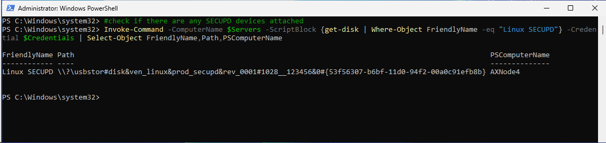

if so, reboot iDRAC from webUI as it would interrupt deployment process as it would find attached USB media.

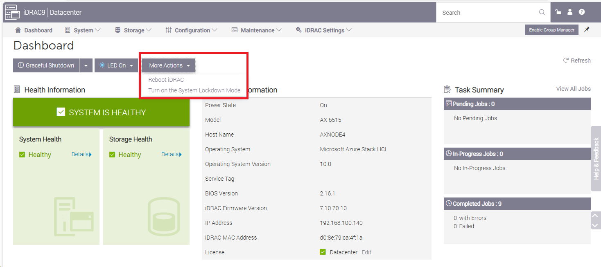

#### Step 5 - Install just Network Drivers - Mellanox

In case you want install just network driver, here is PowerShell script

```PowerShell
#check version
$NICs=Invoke-Command -ComputerName $Servers -Credential $Credentials -ScriptBlock {get-NetAdapter}
$NICs | Where-Object interfacedescription -like Mellanox* | Select-Object Driver*

#region or install Mellanox network driver
    $MLNXDownloadFolder="c:\Temp\Mellanox"

    #Set up web client to download files with autheticated web request
    $WebClient = New-Object System.Net.WebClient
    #$proxy = new-object System.Net.WebProxy
    $proxy = [System.Net.WebRequest]::GetSystemWebProxy()
    $proxy.Credentials = [System.Net.CredentialCache]::DefaultCredentials
    #$proxy.Address = $proxyAdr
    #$proxy.useDefaultCredentials = $true
    $WebClient.proxy = $proxy

    $MLNXDriver="https://www.mellanox.com/downloads/WinOF/MLNX_WinOF2-24_4_50000_All_x64.exe"

    if (-not (Test-Path $MLNXDownloadFolder -ErrorAction Ignore)){New-Item -Path $MLNXDownloadFolder -ItemType Directory}
    #Start-BitsTransfer -Source $MLNXDriver -Destination $MLNXDownloadFolder\MLNX_WinOF2-24_4_50000_All_x64.exe
    $WebClient.DownloadFile($MLNXDriver,"$MLNXDownloadFolder\MLNX_WinOF2-24_4_50000_All_x64.exe")

    #unzip driver
    &"$MLNXDownloadFolder\MLNX_WinOF2-24_4_50000_All_x64.exe" /a /vMT_DRIVERS_ONLY=1 /v"/qb TARGETDIR=$MLNXDownloadFolder\Driver"

    #upload Driver to servers
    $Sessions=New-PSSession -ComputerName $Servers -Credential $Credentials
    Invoke-Command -Session $Sessions -ScriptBlock {
        if (-not (Test-Path $using:MLNXDownloadFolder -ErrorAction Ignore)){New-Item -Path $using:MLNXDownloadFolder -ItemType Directory}
    }
    foreach ($Session in $Sessions){
        Copy-Item -Path "$MLNXDownloadFolder\Driver" -Destination "$MLNXDownloadFolder" -ToSession $Session -Force -Recurse
    }

    #install Driver
    Invoke-Command -Session $Sessions -ScriptBlock {
        pnputil /add-driver "$using:MLNXDownloadFolder\Driver\mlx5.inf" /install
        pnputil /enum-drivers
    }
#endregion

#check version again
$NICs=Invoke-Command -ComputerName $Servers -Credential $Credentials -ScriptBlock {get-NetAdapter}
$NICs | Where-Object interfacedescription -like Mellanox* | Select-Object Driver*
 
```

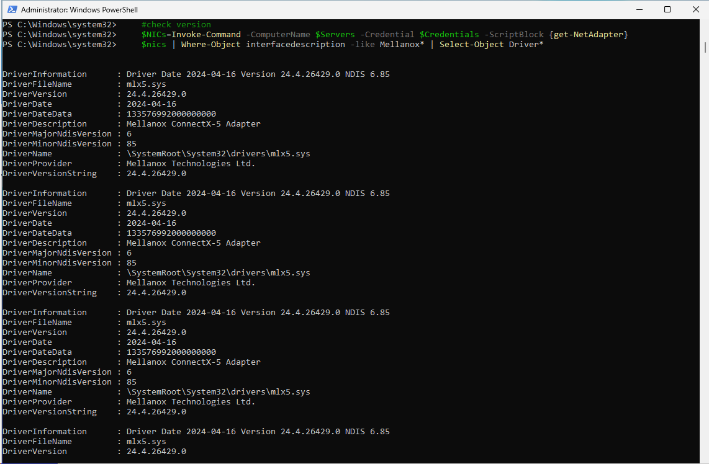

### Task 09 - Deploy Azure Local from Azure Portal

Use values below for virtual cluster

```
Basics:
    Resource Group: ALClus01-RG
    ClusterName:    ALClus01
    Keyvaultname:   <Just generate new>

Configuration:
    New Configuration

Networking
    Network Switch for storage
    Group All traffic

    Network adapter 1:          Ethernet
    Network adapter 1 VLAN ID:  711 (default)
    Network adapter 2:          Ethernet 2
    Network adapter 2 VLAN ID:  712 (default)

    RDMA Protocol:              Disabled (in case you are running lab in VMs)
    Jumbo Frames:               1514 (in case you are running lab in VMs as hyper-v does not by default support Jumbo Frames)

    Starting IP:                10.0.0.111
    ENding IP:                  10.0.0.116
    Subnet mask:                255.255.255.0
    Default Gateway:            10.0.0.1
    DNS Server:                 10.0.0.1

Management
    Custom location name:       ALClus01CustomLocation (default)\
    Azure storage account name: <just generate new>

    Domain:                     corp.contoso.com
    Computer name prefix:       ALClus01
    OU:                         OU=ALClus01,DC=Corp,DC=contoso,DC=com

    Deployment account:
        Username:               ALClus01-LCMUser
        Password:               LS1setup!LS1setup!

    Local Administrator
        Username:               Administrator
    Password:                   LS1setup!LS1setup!

Security:
    Customized security settings
        Unselect Bitlocker for data volumes (would consume too much space)

Advanced:
    Create workload volumes (Default)

Tags:
    <keep default>
```

