# Windows Defender Application Control deep dive
<!-- TOC -->

- [Windows Defender Application Control deep dive](#windows-defender-application-control-deep-dive)
    - [About the lab](#about-the-lab)
    - [Prerequsites](#prerequsites)
    - [Theory](#theory)
    - [Exploring the WDAC feature](#exploring-the-wdac-feature)
    - [Explore WDAC policies using CiTool.exe](#explore-wdac-policies-using-citoolexe)
    - [Explore Policies settings](#explore-policies-settings)
    - [Allow 3rd party application](#allow-3rd-party-application)
        - [First let's try to run application](#first-lets-try-to-run-application)
        - [Explore event log](#explore-event-log)
        - [Let's explore binary](#lets-explore-binary)
        - [Create a code integrity policy file and explore output](#create-a-code-integrity-policy-file-and-explore-output)
        - [Now you can simply add policy](#now-you-can-simply-add-policy)
        - [Policy is now added](#policy-is-now-added)

<!-- /TOC -->

## About the lab

In this lab we will explore WDAC policies and allow 3rd party software by creating a WDAC supplemental policy to allow software signed using publisher certificate

## Prerequsites

The main prerequisite is to have Azure Local to play with. You can follow [Azure Local](../../lab-guides/01a-DeployAzureStackHCICluster-CloudBasedDeployment/readme.md) deployment guide to create one.

## Theory

Windows Defender Application Control is a new name for User-mode code integrity/SmartLocker feature enforced using Hyper-V Code Integrity (HVCI) introduced as part of kernel enhancements in Windows 10 (together with Virtual Secure Mode and many other features). You can learn more about the kernel enhancements in these videos, that are unfortunately only available via [webarchive](https://web.archive.org/web/20160308083925/https://channel9.msdn.com/Tags/kernel). The one that is talking about code integrity is [here](https://web.archive.org/web/20160308083906/https://channel9.msdn.com/Blogs/Seth-Juarez/Windows-10-Virtual-Secure-Mode-with-David-Hepkin?ocid=relatedentry)

I would recommend watching all VSM related videos as it also helps understand other Hyper-V security features (IO-MMU,TPM, Secure Boot,SLAT,Virtual Trust Levels, Trustlets...)

## Exploring the WDAC feature

```PowerShell
$ClusterName="AXClus02"
#check that wdac services are running
Get-Service -Name applockerfltr,appidsvc,appid -ComputerName $ClusterName

#check User Mode Code Integrity status on machine (UserModeCodeIntegrityPolicyEnforcementStatus) 2=enforced 1=audit 0=disabled
Get-CimInstance -ClassName Win32_DeviceGuard -Namespace root\Microsoft\Windows\DeviceGuard -CimSession $ClusterName

```

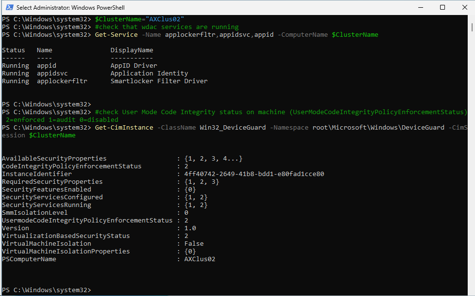

To check the WDAC enforcement and configuration using Azure Local commands, you can use Microsoft.AS.Infra.Security.WDAC PowerShell module available ond nodes

```PowerShell
$ClusterName="AXClus02"

Invoke-Command -ComputerName $ClusterName -ScriptBlock {
    Get-Command -Module Microsoft.AS.Infra.Security.WDAC
    Get-ASLocalWDACPolicyInfo
    Get-ASLocalWDACPolicyMode
}
 
```

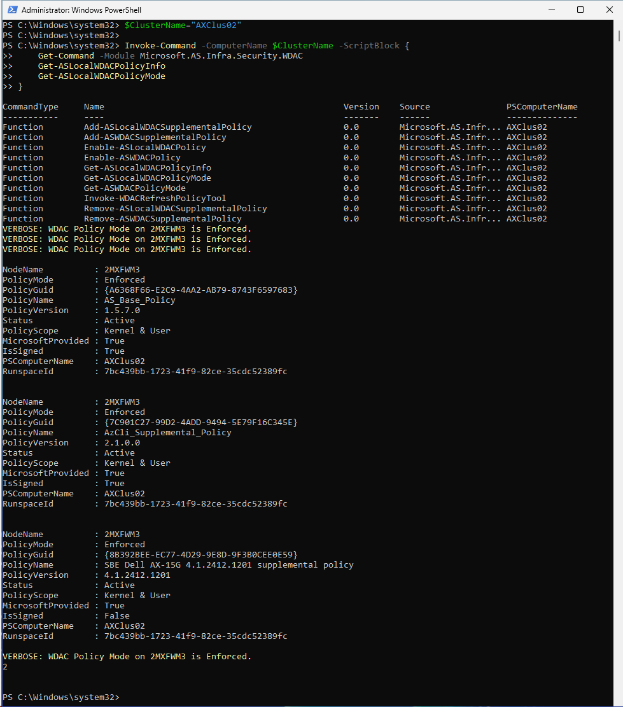

From Commands above you can see, that by default is policy enforced and there are 3 policies applied. These policies are located in C:\Windows\System32\CodeIntegrity\CiPolicies\Active\

To explore more you can get into the WDACPolicy commands and learn, that it uses CiTool to explore and configure policies

```PowerShell 
Invoke-Command -ComputerName $ClusterName -ScriptBlock {
    (Get-Command -Name Get-ASLocalWDACPolicyInfo).ScriptBlock
}
 
```

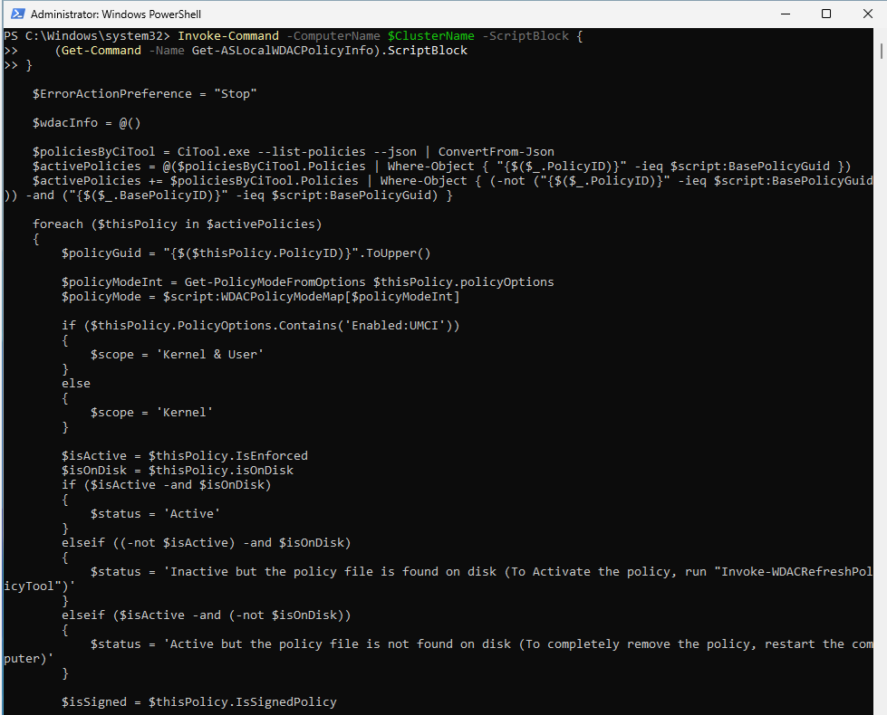

## Explore WDAC policies using CiTool.exe

https://learn.microsoft.com/en-us/windows/security/application-security/application-control/app-control-for-business/operations/citool-commands

```PowerShell
Invoke-Command -ComputerName $ClusterName -ScriptBlock {
    $JSON= CiTool.exe --list-policies --json | ConvertFrom-Json
    $JSON.Policies
}
 
```

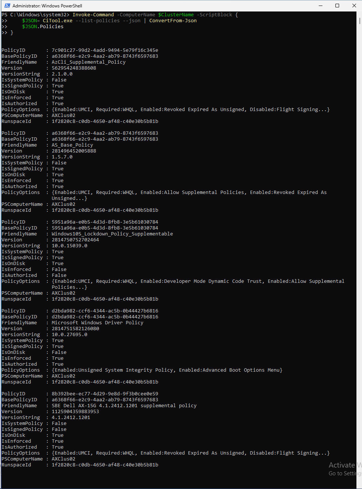

## Explore Policies settings

to understand what is in policy, it needs to be converted from binary file. I found a tool - CIPolicyParser.ps1 https://gist.github.com/mattifestation/92e545bf1ee5b68eeb71d254cec2f78e

Let's convert policies into XML into downloads folder, so it can be explored

```PowerShell
$ClusterName="AXClus02"

Invoke-Command -ComputerName $ClusterName -ScriptBlock {
    $Policies=Get-ASLocalWDACPolicyInfo
    (Invoke-WebRequest -Uri https://gist.githubusercontent.com/mattifestation/92e545bf1ee5b68eeb71d254cec2f78e/raw/a9b55d31075f91b467a8a37b9d8b2d84a0aa856b/CIPolicyParser.ps1 -UseBasicParsing).Content | Out-File $env:userprofile\Downloads\CIPolicyParser.ps1
    . $env:userprofile\Downloads\CIPolicyParser.ps1
    foreach ($Policy in $Policies){
        ConvertTo-CIPolicy -BinaryFilePath "C:\windows\system32\CodeIntegrity\CiPolicies\Active\$($Policy.PolicyGUID).cip" -XmlFilePath "$env:USERPROFILE\Downloads\$($Policy.PolicyName).xml" -ErrorAction SilentlyContinue
    }
}

```

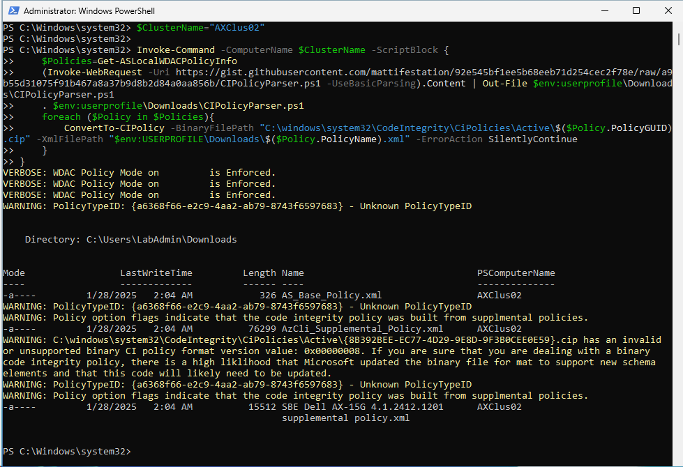

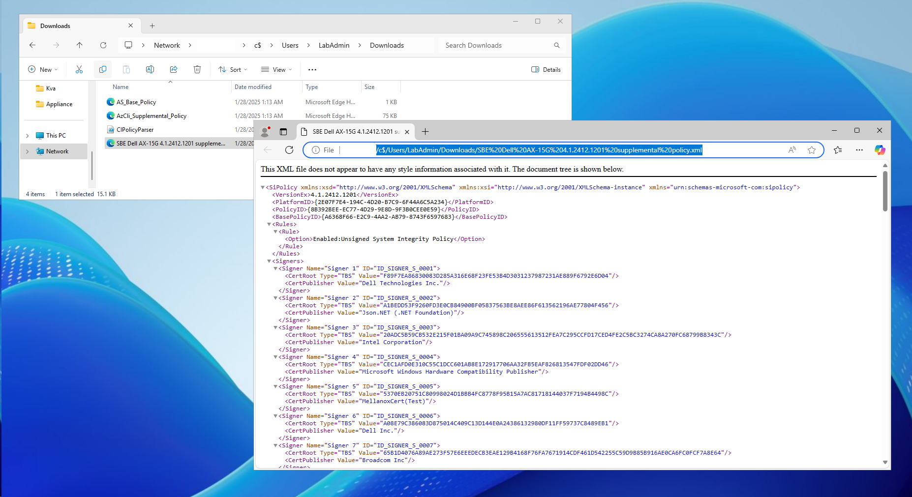

Unfortunately not all policies are translated back to xml from binary correctly.

## Allow 3rd party application

Documentation:  
* https://learn.microsoft.com/en-us/azure/azure-local/manage/manage-wdac
* https://learn.microsoft.com/en-us/powershell/module/configci/new-cipolicy?view=windowsserver2025-ps


### First let's try to run application

For demonstration we'll download Telegraf Agent to demonstrate 3rd party app running with default security settings.

```PowerShell
$ClusterName="AXClus02"

Invoke-Command -ComputerName $ClusterName -ScriptBlock {
    Start-BitsTransfer -Source "https://dl.influxdata.com/telegraf/releases/telegraf-1.33.1_windows_amd64.zip" -Destination "$env:USERPROFILE\Downloads\telegraf-1.33.1_windows_amd64.zip"
    Expand-Archive -Path "$env:USERPROFILE\Downloads\telegraf-1.33.1_windows_amd64.zip" -DestinationPath "$env:USERPROFILE\Downloads" -Force
    Rename-Item -Path "$env:USERPROFILE\Downloads\telegraf-1.33.1" -NewName "telegraf"
    & "$env:USERPROFILE\Downloads\Telegraf\telegraf.exe"
}
 
```

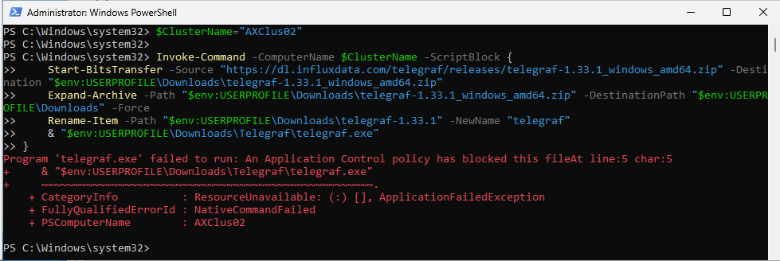

as you can see, App was blocked with code integrity rule

### Explore event log

Let's explore events from all cluster nodes

```PowerShell
#make sure failover clustering is installed
Install-WindowsFeature -Name RSAT-Clustering
$Servers=(Get-ClusterNode -Cluster $ClusterName).Name
$events=Invoke-Command -ComputerName $Servers -ScriptBlock {
    Get-WinEvent -FilterHashtable @{"ProviderName"="Microsoft-Windows-CodeIntegrity";Id=3077} -ErrorAction Ignore
}
$events.message | Select-Object -Unique
 
```

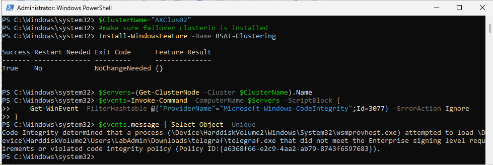

The message contains the blocked binary and which policy was violated.

### Let's explore binary

As software can be allowed multiple ways, it's important to explore if we can simply allow publisher of the application. To do that, we need to understand if application is signed

```PowerShell
Invoke-Command -ComputerName $ClusterName -ScriptBlock {
    $FileInfo=Get-AuthenticodeSignature -FilePath $env:userprofile\Downloads\telegraf\telegraf.exe 
    $FileInfo.SignerCertificate
}

```

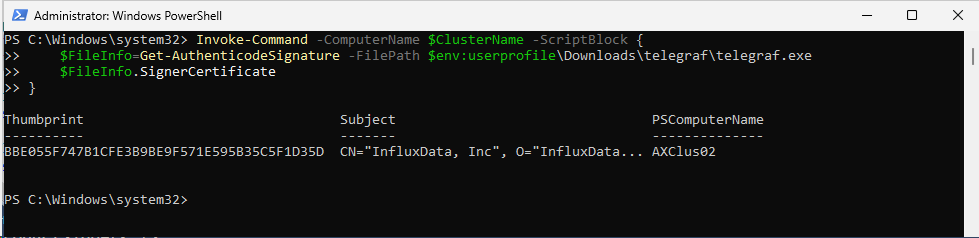

As you can see, this application publisher is "InfluxData, Inc".

### Create a code integrity policy file and explore output

```PowerShell
Invoke-Command -ComputerName $ClusterName -ScriptBlock {
    $PolicyPath="$env:userprofile\Downloads\Telegraf-policy.xml"
    $ScanPath="$env:userprofile\Downloads\telegraf\"
    #I skipped failback rule (hash) as if for some reason file was not signed, updating to newer version would result in blocking the file again.
    New-CIPolicy -ScanPath $ScanPath -MultiplePolicyFormat -Level Publisher -FilePath $PolicyPath -UserPEs
    #let's also configure name and version
    $policyVersion = "1.0.0.0"
    Set-CIPolicyVersion -FilePath $env:userprofile\Downloads\Telegraf-policy.xml -Version $policyVersion
    #And some more Policy Info (PolicyName, PolicyID in the XML file)
    Set-CIPolicyIdInfo -FilePath $policyPath -PolicyID "Contoso-Telegraf_$policyVersion" -PolicyName "Contoso-Telegraf"
    Get-Content $PolicyPath
}

```

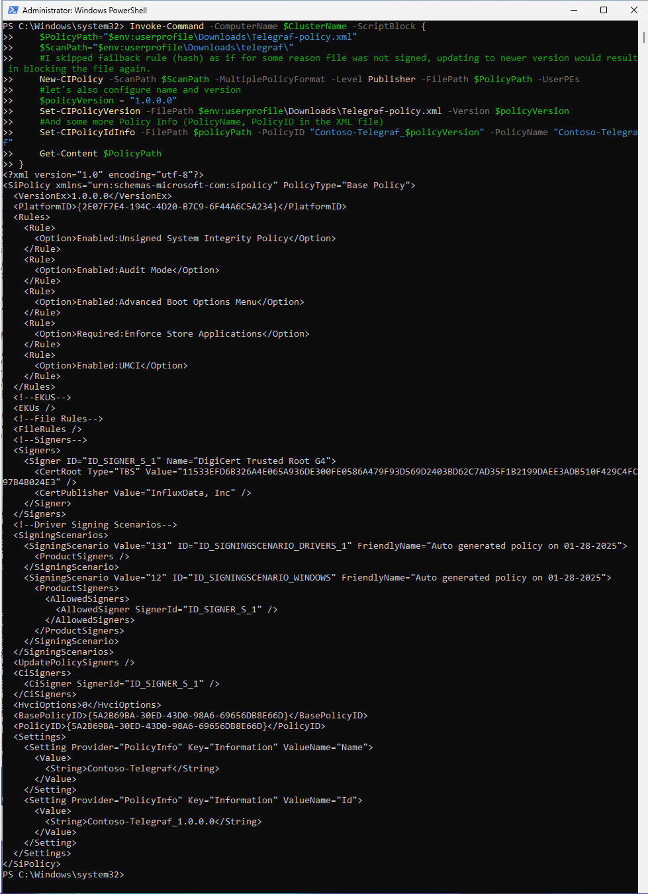

[Telegraf policy](./media/Telegraf-policy.xml)

### Now you can add policy

Next just add it into supplemental policy. To add policy you either have to do it from the node, or you need to use [CredSSP](https://github.com/DellGEOS/AzureLocalHOLs/tree/main/tips&tricks/11-WS2025CredSSP) to be able to send credentials to another node.

```PowerShell
$ClusterName="AXClus02"
$username="CORP\LabAdmin"
$password = ConvertTo-SecureString "LS1setup!" -AsPlainText -Force
$Credentials = New-Object System.Management.Automation.PSCredential ($username,$password)

# Temporarily enable CredSSP delegation to avoid double-hop issue
Enable-WSManCredSSP -Role "Client" -DelegateComputer $ClusterName -Force
Invoke-Command -ComputerName $ClusterName -ScriptBlock { Enable-WSManCredSSP Server -Force }


#send the command
Invoke-Command -ComputerName $ClusterName -Credential $Credentials -Authentication Credssp -ScriptBlock {
    Add-ASWDACSupplementalPolicy -Path $env:userprofile\Downloads\Telegraf-policy.xml
}

# Disable CredSSP
Disable-WSManCredSSP -Role Client
Invoke-Command -ComputerName CA -ScriptBlock { Disable-WSManCredSSP Server }
 
```

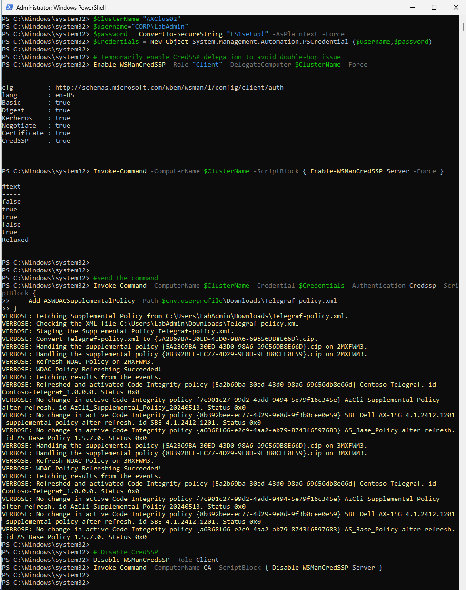


### Policy is now added

```PowerShell
Invoke-Command -ComputerName $ClusterName -ScriptBlock {
    Get-ASLocalWDACPolicyInfo
}
 
```

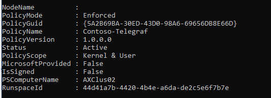
